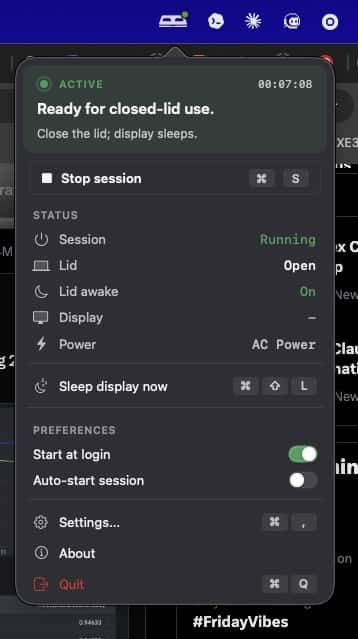

# Clolid

<p align="center">
  
</p>

Clolid is a lightweight macOS menu bar app for closed-lid desk setups. It keeps the Mac awake while the lid is closed and immediately asks macOS to sleep the built-in display when the lid-close event is detected.

The app is intentionally small: it wraps the system power tools needed for this workflow instead of trying to replace a full power-management utility.

<p align="center">
  
</p>

## Features

- Start and stop a closed-lid awake session from the menu bar.
- Run `pmset disablesleep` only for the active session.
- Keep the system awake with `caffeinate`.
- Watch the lid state and call `pmset displaysleepnow` when the lid closes.
- Optional notifications for session start and lid-close display sleep.
- Optional start-at-login LaunchAgent.
- Settings for external-power requirement, polling interval, and menu-bar icon style.

## Requirements

- macOS 13 or newer.
- Xcode command line tools.
- Administrator permission when starting or stopping a session, because Clolid changes `pmset disablesleep`.

## Download

Download the latest `Clolid-*-macOS.zip` from the [GitHub Releases page](https://github.com/pixexid/Clolid/releases). Unzip it and move `Clolid.app` to `/Applications`.

The app is currently distributed as an unsigned open-source build. On first launch, macOS may require opening it from Finder with Control-click -> Open.

## Build

```bash
swift build
```

## Run Locally

```bash
./script/build_and_run.sh
```

The script builds the SwiftPM executable, creates `dist/Clolid.app`, copies the app resources, and opens the app.

For a quick launch check:

```bash
./script/build_and_run.sh --verify
```

## Package a Release Build

```bash
./script/package_release.sh
```

The package script creates `dist/Clolid.app` and `releases/Clolid-<version>-macOS.zip` without launching the app. Attach that zip to the matching GitHub Release.

## How It Works

When a session starts, Clolid runs:

```bash
sudo pmset -a disablesleep 1
caffeinate -i -s -u
```

While the session is running, Clolid polls `AppleClamshellState` through `ioreg`. When the lid changes to closed, it runs:

```bash
pmset displaysleepnow
```

When the session stops, Clolid terminates its own `caffeinate` process and restores:

```bash
sudo pmset -a disablesleep 0
```

## Safety Notes

Clolid is designed for setups with external power and, usually, an external display. If the Mac is closed in a bag or poorly ventilated space while a session is active, it can continue running and generate heat. Use the external-power requirement if you want an additional guardrail.

If you ever need to restore normal sleep manually:

```bash
sudo pmset -a disablesleep 0
pkill caffeinate
```

## Project Layout

```text
Package.swift
Sources/Clolid/main.swift
Sources/Clolid/Resources/
script/build_and_run.sh
```

## Versioning

Clolid follows Semantic Versioning. See [VERSIONING.md](VERSIONING.md).

## Contributing

Issues and pull requests are welcome. See [CONTRIBUTING.md](CONTRIBUTING.md).

## License

Clolid is released under the MIT License. See [LICENSE](LICENSE).
