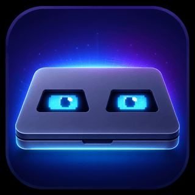

# Clolid

<p align="center">
  
</p>

Clolid is a lightweight macOS menu bar app for closed-lid desk and unattended-agent setups. It keeps the Mac awake while the lid is closed, observes the live display topology, and applies a mode-specific display policy.

The app is intentionally small: it wraps the system power tools needed for this workflow instead of trying to replace a full power-management utility.

## Features

- Start and stop a closed-lid awake session from the menu bar.
- Run `pmset disablesleep` only for the active session.
- Choose Standard mode for the existing closed-lid workflow or Agent Display mode for unattended computer-use agents.
- Keep the system awake with a mode-specific `caffeinate` assertion.
- Stabilize CoreGraphics display-topology changes before deciding whether to sleep displays.
- Wake a connected Agent Display with a separate five-second user-activity pulse.
- Verify external keyboards and pointing devices from IOKit HID metadata.
- Report Agent Display readiness with blocking conditions and honest advisories.
- Optional notifications for session start and lid-close display sleep.
- Optional start-at-login LaunchAgent.
- Settings for external-power requirement, polling interval, and menu-bar icon style.
- Optional session-scoped Screen Lock policy using macOS `sysadminctl`.

## Requirements

- macOS 13 or newer.
- Administrator permission when starting or stopping a session, because Clolid changes `pmset disablesleep`.
- Accessibility permission for Agent Display recovery input. Clolid posts only a one-pixel mouse move and restore when all external displays drop after lid close.
- External power and an active external display are strongly recommended for unattended Agent Display sessions.

Building Clolid from source also requires the Xcode command line tools.

## Install

Download the latest `Clolid-*-macOS.zip` from the [GitHub Releases page](https://github.com/pixexid/Clolid/releases). Unzip it and move `Clolid.app` to `/Applications`.

Release archives are ad-hoc signed but are not Developer ID signed or notarized. On first launch, macOS Gatekeeper may require opening `/Applications/Clolid.app` from Finder with Control-click -> Open.

Keep only the installed `/Applications/Clolid.app` in normal use. Running another build from `dist/Clolid.app` can create duplicate macOS permission entries for the same app name.

## Quick Start

1. Open `/Applications/Clolid.app`.
2. Choose `Agent Display` for an unattended session that must keep the external display awake. Choose `Standard` only when Clolid should sleep all displays after a confirmed lid-close transition with no external display.
3. Press `Start session` and approve the administrator prompt.
4. If macOS requests Accessibility access, enable the exact `/Applications/Clolid.app` entry, reopen Clolid, and start the session again.
5. Wait for readiness, then close the lid.

Agent Display readiness uses three colors:

- Green `Ready` means all checked requirements passed.
- Yellow `Ready with advisories` is non-blocking. A yellow status is expected while the lid is open; battery power, settling topology, or an unverified input or Screen Lock state can also produce an advisory.
- Red `Not ready` or a red notice is blocking and should be resolved before closing the lid.

## Permissions

- **Administrator:** Required on session start and stop so Clolid can change `pmset disablesleep`.
- **Accessibility:** Required only for Agent Display's bounded recovery input. Grant it to `/Applications/Clolid.app`, not a development copy under `dist`.
- **Notifications:** Optional. Clolid can request banners for session, lid-close, and missing-display events.
- **Input Monitoring:** Not required. Clolid reads static IOKit device metadata without opening or monitoring keyboard, mouse, or trackpad input.

## Build

```bash
swift build
```

## Run Locally

```bash
./script/build_and_run.sh
```

The script builds the SwiftPM executable, creates `dist/Clolid.app`, copies the app resources, and opens the app.

For a quick launch check:

```bash
./script/build_and_run.sh --verify
```

## Package a Release Build

```bash
./script/package_release.sh
```

The package script compiles the optimized Swift `release` configuration, creates and verifies an ad-hoc-signed `dist/Clolid.app`, and writes `releases/Clolid-<version>-macOS.zip` without launching the app. Attach that zip to the matching GitHub Release.

## How It Works

When a session starts, Clolid enables `disablesleep` and launches one owned assertion process:

```bash
sudo pmset -a disablesleep 1
```

Standard mode uses:

```bash
caffeinate -i -s
```

Agent Display mode uses:

```bash
caffeinate -d -i -s
```

Agent Display mode prevents automatic display sleep. Changing modes during an active session starts the replacement assertion before stopping the previous Clolid-owned process.

While the session is running, Clolid reads `AppleClamshellState` and captures CoreGraphics topology snapshots. A display-reconfiguration callback triggers a fresh snapshot, while the normal lid poll remains the fallback.

In Standard mode, a closed-lid transition must produce three time-spaced topology samples with no external display before Clolid runs:

```bash
pmset displaysleepnow
```

The pre-close topology remains authoritative for the whole transition. A transient disconnect cannot authorize display sleep if an external display was present before or during the lid-close change.

In Agent Display mode, Clolid never runs the automatic display-sleep command. When an external display is available at lid close, Clolid launches a separate, self-expiring wake pulse and renews it once after the closed-lid topology stabilizes. When a display first reconnects during settling, Clolid launches one pulse:

```bash
caffeinate -u -t 5
```

If macOS still drops all external displays after settling, Clolid makes one recovery attempt. It starts the same bounded wake pulse, posts a one-pixel mouse move and restore through CoreGraphics, then verifies the topology again. This is intended to engage macOS desktop/clamshell mode without clicking, typing, or moving the pointer from its original position.

The manual display-sleep command remains available in both modes and sleeps all displays.

Agent Display readiness checks the session, `disablesleep`, the long-lived assertion, external-display activity, topology stability, power source, external input devices, and Screen Lock status. Clolid recognizes physical USB and Bluetooth keyboards, mice, and trackpads from static IOKit HID metadata without opening the devices or capturing input. A confirmed missing device blocks readiness. Incomplete metadata, unsupported transports, or IOKit enumeration failures remain advisories rather than being silently reported as present or absent.

### External Displays and Dummy HDMI Plugs

Clolid uses the CoreGraphics online and active display topology. A dummy HDMI plug can keep an external display entry present, but macOS does not expose a reliable general-purpose signal that distinguishes every dummy adapter from a physical panel. A dummy may therefore satisfy the external-display readiness check even when a specific physical monitor has no signal.

Before unattended use, confirm that the intended physical display is shown in Clolid's `Display` row and complete a real lid-close test. Reconnecting a physical display should trigger a topology refresh and one bounded Agent Display wake pulse.

Clolid can also apply a session-scoped Screen Lock policy using `sysadminctl -screenLock`, which is the source that matches macOS Lock Screen settings on current macOS releases. The app asks for your Mac login password in a Clolid-styled prompt when a non-System Screen Lock policy is applied during a session, passes it to macOS for that command, and does not store it.

Use `System` to leave the setting untouched. Use `No lock` only for trusted long-running local automation sessions where you accept that the user session stays unlocked while the display is off.

When the session stops, Clolid terminates only its owned `caffeinate` process and restores:

```bash
sudo pmset -a disablesleep 0
```

Crash recovery verifies the saved PID, exact executable path, and process start identity before signaling a stale assertion, preventing a reused PID from being treated as Clolid-owned.

## Troubleshooting

### Accessibility remains red

Confirm that System Settings -> Privacy & Security -> Accessibility contains the installed `/Applications/Clolid.app`. If multiple Clolid entries exist, quit every copy, remove the duplicates, add the installed app explicitly, enable it, reopen Clolid, and start the session again. Input Monitoring does not satisfy or replace this permission.

### Readiness is yellow

Open the Clolid menu and read the first readiness detail. `Lid is open` is the normal advisory before a lid-close test. Other yellow advisories identify battery power, topology settling, or a state Clolid could not verify. Yellow does not indicate a denied Accessibility permission.

### External display shows “No Signal” after lid close

Verify that the session is running in Agent Display mode and that Clolid shows the intended physical display before closing the lid. Clolid never automatically runs `pmset displaysleepnow` in Agent Display mode.

Other power utilities, shell scripts, or LaunchAgents can still issue that command and override Clolid. Search common per-user locations with:

```bash
grep -R "pmset displaysleepnow" "$HOME/Library/LaunchAgents" "$HOME/.local" 2>/dev/null
```

Disable only the conflicting job or utility after confirming its purpose. Keep a single owner for lid-close display policy. A physical mouse click waking the display while Clolid remains active is a strong sign that another process explicitly slept the display or that macOS ignored the bounded recovery pulse.

### Restore normal sleep

Quit Clolid first. If `SleepDisabled` remains enabled after an interrupted session, restore it with:

```bash
sudo pmset -a disablesleep 0
```

## Safety Notes

Clolid is designed for setups with external power and, usually, an external display. If the Mac is closed in a bag or poorly ventilated space while a session is active, it can continue running and generate heat. Use the external-power requirement if you want an additional guardrail.

Quit Clolid to terminate the assertion process it owns. Avoid `pkill caffeinate`, which can terminate unrelated processes started by other apps or shell sessions.

If Screen Lock was changed outside Clolid, configure “Require password after screen saver begins or display is turned off” in System Settings or check the effective value with `sysadminctl -screenLock status`.

## Project Layout

```text
Package.swift
Sources/Clolid/main.swift
Sources/Clolid/Resources/
Sources/ClolidCore/
Sources/ClolidRuntime/
Tests/ClolidCoreTests/
Tests/ClolidRuntimeTests/
script/build_and_run.sh
script/package_release.sh
CHANGELOG.md
VERSION
```

## Versioning

Clolid follows Semantic Versioning. See [VERSIONING.md](VERSIONING.md).

## Contributing

Issues and pull requests are welcome. See [CONTRIBUTING.md](CONTRIBUTING.md).

## License

Clolid is released under the MIT License. See [LICENSE](LICENSE).
